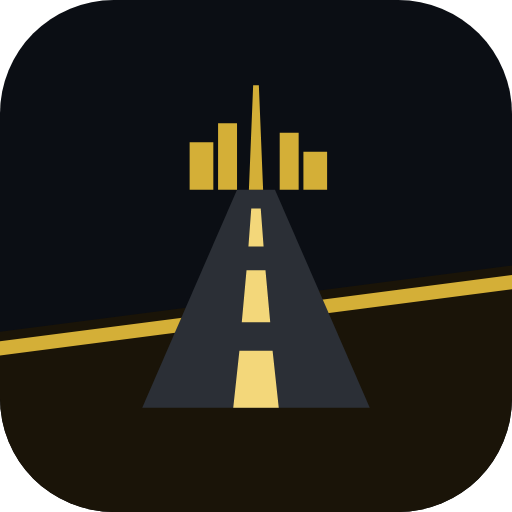

<p align="center"></p>

# UAE Drive – Roads of the Seven Emirates

A 3D driving game for Android that is set on real UAE roads. The roads,
traffic signals, speed limits, speed cameras, Salik/Darb toll gantries and
fuel stations are built from OpenStreetMap data.

## Download the APK

Every push to GitHub runs the **Build APK** workflow (`.github/workflows/build-apk.yml`), which:

1. downloads the ten bundled city packs from OpenStreetMap,
2. builds the game,
3. plays through it end to end in headless Chromium (splash, login, garage, settings, city loading, driving, lights, mirrors, map/GPS, radio, AC, red-light fine, steering modes, pause) and saves screenshots,
4. builds the APK,
5. installs and launches the APK on an Android emulator and checks for crashes,
6. publishes the APK under **Releases** (`UAE-Drive-v1.0.<build>.apk`).

To install it on your phone, open the release page there, download the `.apk`,
and allow "Install unknown apps" when Android asks. You need Android 7.0 or
later with OpenGL ES 3, which covers nearly every phone made since 2016.

## Features

| Area | What you get |
| --- | --- |
| **Maps** | 10 offline city packs across all 7 emirates: Downtown Dubai, Marina/JBR, Deira, Abu Dhabi, Al Ain, Sharjah, Ajman, Umm Al Quwain, Ras Al Khaimah and Fujairah. **Explore anywhere** downloads live roads around any landmark, coordinates or your GPS position. Where the map has too few roads, generated roads fill the area. |
| **Road rules** | Real traffic lights with phased junctions, stop lines, speed-limit signs, radars (flash at more than 20 km/h over the limit), Salik (Dubai) and Darb (Abu Dhabi) toll gates, fuel stations and rest areas. |
| **Fines** | Based on UAE federal fine tables: red light AED 1,000 + 12 black points, speeding bands AED 300–3,000, not indicating AED 400, no headlights at night AED 500, collisions. There is also a road-safety course that clears black points. |
| **Cars** | 8 fictional cars: luxury saloon, coupé, G-Line 4x4 (G-Wagon-style), grand SUV, GT, two supercars and a hypercar. Each has clear-coat paint, 5 colours, working lights, indicators, reverse lights and a steering wheel. |
| **Cameras** | Chase, far chase, cockpit (interior with the live map on the centre screen), bonnet and cinematic. |
| **Mirrors** | Rear-view mirror and left/right side mirrors show **live views** of the traffic behind you. You can show all three, the rear-view only, or none. |
| **Controls** | Arrow buttons, an on-screen **steering wheel** or **gyroscope tilt**, chosen in Settings. Also gas and brake pedals, handbrake, horn and keyboard for PC testing. |
| **Car functions** | Low and high beam headlights, left/right indicators that cancel themselves, hazards, horn, climate control (temperature, fan, auto, recirculation, with cabin temperature that reacts to outside heat), fuel and refuelling. |
| **Time & weather** | Dawn, morning, noon, sunset and night, with an optional day/night cycle. Seasons: hazy summer (44 °C), clear winter, winter rain, sandstorm (shamal) and morning fog. |
| **Radio & music** | Online radio with Bollywood, Hollywood hits, Arabic, UAE stations, Punjabi, hip-hop, rock, chill and EDM, through the free radio-browser.info directory. **My Music** plays songs from your own phone. |
| **Navigation** | A rotating minimap, a full-screen map with pinch zoom, and tap-to-set GPS routes (A*) on the real road graph. |
| **Game modes** | Free roam, chauffeur runs (pick up and drop off a VIP) and an RTA-style driving test that fails on any violation. |
| **Graphics** | Auto, Low, Medium, High and Ultra quality presets, and resolution choices of Auto, 540p, 720p, **1080p Full HD** and 1440p. Includes shadows, bloom, reflections, palm trees, streetlights and lit windows at night. |
| **Accounts** | Google Play Games and Facebook sign-in (they need the app IDs below), and guest mode. Progress, money, cars, stats and settings are saved on the phone. |

## Technology stack

| Layer | What the game uses | What it does |
| --- | --- | --- |
| **Systems** (Rust) | `physics/`: a Rust crate compiled to WebAssembly | Vehicle dynamics: a bicycle model with Pacejka "magic formula" tyres, weight transfer, friction circle, AWD/RWD, brake bias, handbrake drifts and fixed 240 Hz sub-steps. It also moves the weather particles and writes them straight into the GPU vertex buffer. It has 9 unit tests (0–100 time, top speed, braking distance, steering direction, stability, drift, reverse, frame-rate independence). A JS fallback is kept. |
| **Graphics API** | WebGL 2 / OpenGL ES 3 | On modern Android devices, the system WebView runs WebGL through Google's ANGLE layer, which usually uses **Vulkan**. Older devices use OpenGL ES. |
| **GPU / shading** (GLSL) | `game/src/render/cinematic.js` plus the three.js PBR shaders | HDR half-float rendering with 4× MSAA, GTAO ambient occlusion (Ultra), bloom, ACES tone mapping, and a custom GLSL cinematic pass. That pass adds desert heat haze over the horizon, radial speed blur, chromatic aberration, filmic lift/gamma/gain grading per time of day and weather, vignette and film grain. There are also sun lens flares, wet-road reflections in rain, PBR clear-coat car paint and soft sun shadows that follow the car. |
| **Tools / pipeline** | Node.js tools in `tools/` | OpenStreetMap → game-map converter, map-pack downloader, and end-to-end tests. |

A native C++/Vulkan engine with Houdini (VEX) or Maya (Python) content tools
would be a separate, much larger project. The practical route to that is
Unreal Engine 5, which uses C++, Vulkan on Android, HLSL shaders and Python
editor scripting. The road-network converter in this repo could feed such a
project.

## Honest notes and limitations

* **Google Maps / Waze data isn't used.** Their terms don't allow copying their
  roads, imagery, speed limits or camera locations into another product, and
  Waze has no public data API. OpenStreetMap is the legal, free alternative, and
  in the UAE it maps speed limits, signals, cameras and tolls well. Where a value
  is missing, the game uses UAE default limits (motorway 120, trunk 100,
  primary 80, secondary 60, residential 40) and places radars, tolls and fuel
  stations by rule.
* **The whole UAE can't load at once on a phone.** The game loads about
  3 km × 3 km at a time. The bundled packs cover the main city centres, and
  *Explore anywhere* loads any other spot on demand. Downloaded areas are cached
  for offline use.
* **Real car brands need a licence.** Mercedes-Benz and the other brand names,
  logos and exact designs are trademarks. The cars here are original designs
  inspired by those classes. Licensed models can be added later.
* **No music is bundled.** Hollywood and Bollywood songs are copyrighted, so the
  radio streams public stations and *My Music* plays files you own.
* **Instagram login no longer exists for apps.** Meta shut down the Instagram
  Basic Display API in December 2024. Instagram users sign in through Facebook.
* The graphics are real-time WebGL. They look good at High/Ultra on modern
  phones, but they don't match a desktop simulator like Euro Truck Simulator 2.
  Lower presets keep older phones smooth.

## Enabling Google Play Games and Facebook sign-in

The APK works without these; the buttons simply say that sign-in isn't set up
yet. To switch sign-in on, add these **repository secrets** (Settings →
Secrets and variables → Actions):

| Secret | Where to get it |
| --- | --- |
| `PLAY_GAMES_APP_ID` | Play Console → Play Games Services → Configuration → *Project ID* (numeric) |
| `FACEBOOK_APP_ID`, `FACEBOOK_CLIENT_TOKEN` | developers.facebook.com → your app → Settings → Basic / Advanced |
| `KEYSTORE_BASE64`, `KEYSTORE_PASSWORD`, `KEY_ALIAS`, `KEY_PASSWORD` | Your release signing key (`base64 -w0 release.keystore`). If these are missing, CI signs with a temporary debug key, so you have to uninstall the old version before installing a new one. |

Play Games also needs the APK's signing-key SHA-1 registered in Play Console.
Facebook needs the package name `ae.uaedrive.game` and the key hash added in
the Facebook app settings.

## Project layout

```
game/                 WebGL game (Three.js + Vite)
  src/world/          OSM converter, road graph, 3D city builder, signals, radars/tolls
  src/cars/           procedural car models, cockpit, catalogue
  src/sim/            vehicle physics, AI traffic, controls (arrows / wheel / tilt)
  src/render/         sky, seasons, weather, quality presets, textures
  src/hud/            speedometer, minimap, GPS map, radio + AC panels
  src/audio/          synthesised engine/indicator sounds, radio & music player
android/              Android app: full-screen WebView, sign-in bridge, file picker, GPS
tools/
  fetch-uae-maps.mjs  downloads the city packs from OpenStreetMap
  e2e-test.mjs        end-to-end browser test with screenshots
```

### Build locally

```bash
cd game && npm ci
node ../tools/fetch-uae-maps.mjs    # optional: offline city packs
npm run build                       # outputs into android/app/src/main/assets/www
node ../tools/e2e-test.mjs ../android/app/src/main/assets/www ../e2e-shots
cd ../android && ./gradlew assembleRelease   # needs the Android SDK
```

`npm run dev` runs the game in a desktop browser. Keyboard controls: arrows or
WASD to drive, Space for the handbrake, H lights, Q/E indicators, Z hazards,
C camera, M map, N horn, Esc pause.

## Credits

Map data © [OpenStreetMap contributors](https://www.openstreetmap.org/copyright), ODbL 1.0.
Radio directory: [radio-browser.info](https://www.radio-browser.info). 3D engine: [three.js](https://threejs.org) (MIT).
